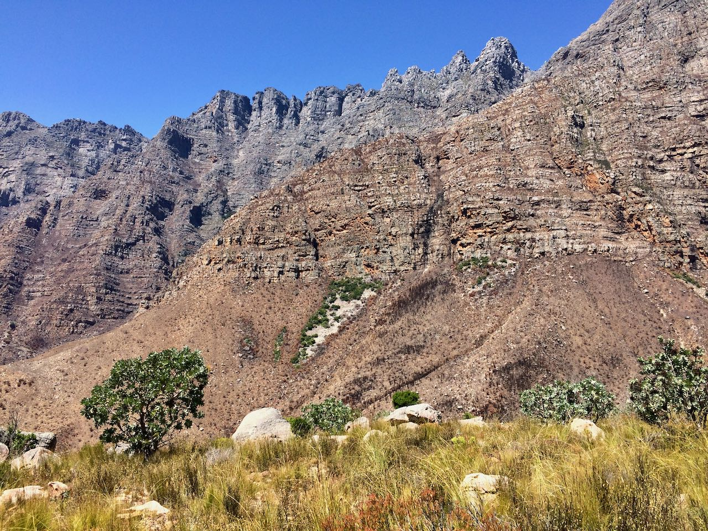

Markov Chain Monte Carlo (MCMC) is the workhorse of modern statistics. Efficient implementations in languages such as [Stan](Stanhttps://mc-stan.org/), [JAGS](http://mcmc-jags.sourceforge.net/), and [PyMC3](https://docs.pymc.io/) and many others mean that nowadays we can simply focus on the statistical model and ecological problems we are interested in and leave the estimation of posterior probabilities to be worked out by the MCMC sampler. There is, however, one MAJOR drawback to MCMC 
  
IT. IS. SLOW.  
  
I mean, when you understand what it is really doing under the hood it is actually doing this really, really fast. It is plenty fast for the majority of analyses - those that do not involve estimating 1000s of parameters. But it does not feel that way when you are trying to fit a model with a parameter for every sites on a large spatial grid or every point in a long time-series. 

A project that I have been working on for a few years involves estimating the postfire recovery of vegetation in the Cape Floristic Region (CFR) of South Africa. Objectivity the most beautiful vegetation on earth



The details are given in [@slingsby_near-real_2020;@wilson_climatic_2015], but in short what we do is estimate the age of a site by calculating the years since the last fire. We then fit a curve to model the recovery of vegetation (measured using NDVI) as a function of it's age. For this we use a negative exponential curve with the following form:

$$\mu_{i,t}=\alpha_i+\gamma_i\Big(1-e^{-\frac{age_{i,t}}{\lambda_i}}\Big)$$

where $\mu_{i,t}$ is the expected NDVI for site $i$ at time $t$

The observed greenness $NDVI_{i,t}$  is assumed to follow a normal distribution with mean $\mu_{i,t}$
$$NDVI_{i,t}\sim\mathcal{N}(\mu_{i,t},\sigma_)$$

An additional level models the parameters of the negative exponential curve as a function of environmental variables. This means that sites with similar environmental conditions should have similar recovery curves. The full model also includes a sinusoidal term to capture seasonal variation, but lets keep it simple here.  

To fit this model, we must estimate multiple parameters for every timestep and every pixel in the landscape on a 250m grid. That ends up at 1440000 * n parameters * t timesteps for the 90 000 km2 of the CFR. As you can imagine the model takes a VERY long time to fit using MCMC (around 2 weeks). 

## MCMC

To get a feel for this problem I will fit the model using MCMC to a small sample of sites from across the region using Stan and R.

Lets load up the libraries we need 

```{r setup, echo=T, eval=T, message=FALSE}
library(cmdstanr)
library(posterior)
library(bayesplot)
library(dplyr)
library(tidyr)
library(stringr)
library(knitr)
library(ggplot2)
color_scheme_set("brightblue")
set.seed(83)
```

and pull in the data for some plots

```{r data_in, echo=T, eval=T, message=FALSE}
#read raw data
postfire <- read.csv("postfire.csv")
#tidy up
postfire <- postfire %>%
  filter(ND>0) %>% #remove impossible NDVI values
  filter(nid %in% as.numeric(sample(levels(as.factor(postfire$nid)),50))) %>% #subset plots
  mutate(age=DA/365.23) %>% #convert age from days to years
  select(age=age,nd=ND,pid=nid,env1=map,env2=tmax01) %>%
  mutate(pid = as.numeric(as.factor(pid))) %>%
  mutate(env1 = (env1 - mean(env1))/sd(env1),env2 = (env2 - mean(env2))/sd(env2)) #standardize env variables

#plots level data on env conditions
postfire_grp <- postfire %>%
  group_by(pid) %>%
  summarise(envg1 = max(env1),envg2 = max(env2))

#prep data for stan
postfire_data <- list(N = nrow(postfire),
                     J= nrow(postfire_grp),
                     nd=postfire$nd,
                     age= postfire$age,
                     pid=postfire$pid,
                     envg1 = postfire_grp$envg1,
                     envg2 = postfire_grp$envg2)

kable(head(postfire))
```

We have `age` in years, a plot identifier `pid`. the observed ndvi `nd` and two plot level environmental variable `env1`, which is mean annual precipitation, and `env2`, which is the summer maximum temperature.  

Lets load up our Stan model which codes the model described above. This is not a particularly clever or efficient way of coding the model, but it is nice and readable and works fine on this example dataset  

```{r model_def, echo=T, eval=T, message=FALSE}
model <- cmdstan_model('firemodel_predict.stan', compile = TRUE)
model$print()
```

We then fit the model

```{r mcmc, echo=T, eval=F, message=FALSE}
fit_mcmc <- model$sample(
  data = postfire_data,
  seed = 123,
  refresh=500,
  chains = 2,
  parallel_chains = 2,
  iter_warmup = 1000,
  iter_sampling = 2000
)
```
```{r mcmc_load, echo=F, eval=T, message=FALSE}
fit_mcmc <- readRDS("fitmcmc.RDS")
```
 
and do the normal checks to see that our MCMC sampler behaved itself (skipped here). If we check our posterior traces for some parameters they looks like healthy, hairy caterpillars
 
```{r mcmc_check2, echo=T, eval=T, message=FALSE}
mcmc_trace(fit_mcmc$draws(c("tau","alpha_mu")))
```

The crux here is how long it takes to run this sampler

```{r mcmc_time, echo=T, eval=T, message=FALSE}
fit_mcmc$time()$total
```

2954 seconds or 50 minutes to do just 50 sites. Remember the full dataset is 1440000 sites. While there are a couple of good options to improve the efficiency of this model, and [neat new ways](https://mc-stan.org/users/documentation/case-studies/reduce_sum_tutorial.html) of parallelizing within-chain operations in Stan, MCMC is always going to take a long time for this kind of task. Wouldn't it be great if there was another, faster way of estimating the full posterior....

## Variational Inference
Variational inference (VI) is a method for approximating the posterior that has been around for a while. VI is much, much faster than MCMC, and can scale to very large datasets. The major drawback that has limited it's use is that model-specific calculations and derivations are required to implement VI. The joke is that deriving your VI algorithm is what you do while you wait for your MCMC sampler to finish. But there has been some exciting activity in VI research lately that has made it possible to automate the process of deriving scalable variational inference algorithms for a wide class of models. I am going to skip the details here, but these publications are worth digging into if you are interested in this [@kucukelbir_automatic_2015;@kucukelbir_automatic_2017;@blei_variational_2017].

The salient point is that Automatic Differentiation Variational Inference (ADVI) turns the task of computing a posterior into an optimization problem - we simply need to use an optimization algorithm like stochastic gradient ascent (SGA) to maximize a loss function. With SGA we can also feed our data in as mini-batches (subsamples), which adds the potential to scale to very large datasets. The best part of all of this is that ADVI is already implemented in a number of probabilistic programming languages, including Stan. All we need is to change one line of code and we can fit the same Stan model using ADVI:

```{r vb, echo=T, eval=F, message=FALSE}
fit_vb <- model$variational(
  data = postfire_data,
  adapt_engaged=FALSE,
  eta=0.1,
  tol_rel_obj = 0.001,
  seed = 123)
```
```{r vb_load, echo=F, eval=T, message=FALSE}
fit_vb <- readRDS("fitvb.RDS")
```

How long did that take?

```{r vb_time, echo=T, eval=T, message=FALSE}
fit_vb$time()$total
```

28 seconds, or about 100 times faster than MCMC. In separate tests I have tried it doesn't seem to take much longer on the full dataset.

## Ok, what's the catch?

ADVI, like all of variational inference, is an approximate inference technique; whereas MCMC, if done right, will converge to the exact posterior. ADVI assumes no dependency (i.e. zero correlations) between parameter distributions, if this is not the case, ADVI can underestimate variances in the parameter distributions (though there are extensions that can help with this).

In practice what this means that if you want to use ADVI it is a good idea to compare posteriors estimated using ADVI and MCMC, if this is possible. For our model the ADVI and MCMC parameter estimates are pretty close

```{r p1, echo=T, eval=T, message=FALSE}
bayesplot_grid(
  mcmc_dens(fit_vb$draws("tau")),
  mcmc_dens(fit_mcmc$draws("tau")),
  titles = c("MCMC", "ADVI"),
  xlim = c(0.04, 0.07)
)
```

```{r p2, echo=T, eval=T, message=FALSE}
bayesplot_grid(
  mcmc_dens(fit_vb$draws("alpha_mu")),
  mcmc_dens(fit_mcmc$draws("alpha_mu")),
  titles = c("MCMC", "ADVI"),
  xlim = c(-2.5, 0)
)
```

```{r p3, echo=T, eval=T, message=FALSE}
bayesplot_grid(
  mcmc_dens(fit_vb$draws(c("gamma_b2","gamma_b1","lambda_b1","lambda_b2"))),
  mcmc_dens(fit_mcmc$draws(c("gamma_b2","gamma_b1","lambda_b1","lambda_b2"))),
  titles = c("MCMC", "ADVI"),
  xlim = c(-1, 1),
  grid_args=list(ncol=2)
)
```

But what we are really interested in with this model is the posterior predictions of observed NDVI. We want to use the model to estimate future NDVI and compare to observations. The idea is that this comparison will allow us to diagnose sites where NDVI is going off-track, and there may be some underlying ecological problem (see [@slingsby_near-real_2020] for more details). Even if ADVI is not exact, if it returns posterior predictive intervals very close to MCMC ina fraction of the time it would mean we could scale this idea to very large areas.

Lets try this on our data. First lets extract the posterior predictive intervals that we generated in the MCMC and ADVI model and wrangle them into a neat data frame

```{r load_obs_data, echo=F, eval=T, message=FALSE}
postfire_data <- readRDS("pdata.RDS")
```
```{r compare_data, echo=T, eval=T, message=FALSE}
#posterior predictive
stan_vb <- fit_vb$summary("nd_new","mean","quantile2")
stan_mcmc <- fit_mcmc$summary("nd_new","mean","quantile2")
#add observed data
stan_vb$method <- "ADVI"
stan_vb$age <- postfire_data$age
stan_vb$pid <- postfire_data$pid
stan_vb$nd <- postfire_data$nd
stan_mcmc$method <- "MCMC"
stan_mcmc$age <- postfire_data$age
stan_mcmc$pid <- postfire_data$pid
stan_mcmc$nd <- postfire_data$nd
#wrangle
stan_ndvi <- rbind(stan_vb,stan_mcmc) %>%
  select(age=age,NDVI=nd,pid,mean,upper=q95,lower=q5,method) %>%
  filter(pid %in% as.numeric(sample(levels(as.factor(stan_vb$pid)),6)))
stan_ndvi$method <- ordered(stan_ndvi$method)
```

When we make this comparison, the posterior predictive intervals from ADVI and MCMC are almost identical

```{r plot, echo=T, eval=T, message=FALSE}
ggplot(data=stan_ndvi,aes(x=age)) +
  geom_line(aes(y=mean,lty=method),colour="blue") +
  geom_line(aes(y=NDVI),colour="black",lwd=0.5,alpha=0.3) +
  geom_ribbon(aes(ymin=lower,ymax=upper,fill=method),alpha=0.5)+
  facet_wrap(~pid) +
  xlim(c(0,20))+
  labs(x="time since fire (years)",y="NDVI") +
  theme_bw()
```

This is great news. If we were trying to make inferences about ecological process from parameters estimates, we would want an exact method like MCMC [@wilson_climatic_2015]. But for the purposes of monitoring vegetation we are not interested in this - we only want a method that give us a good-enough fit and that is practical to deploy. ADVI fits the bill here, and we are excited to see where we go with the newfound ability to scale our analyses to bigger areas and finer scales.