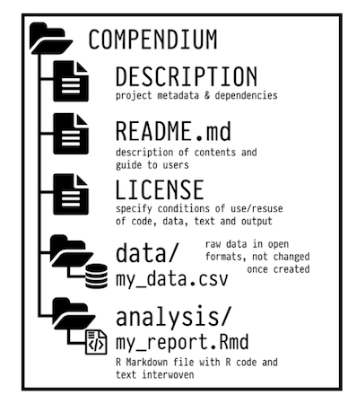

_You will get the most benefit from this tutorial if you already use [git](https://git-scm.com/) and [github](https://github.com/) in your workflow. These are essential tools for reproducibility in science. If you are not familiar with them check out [this tutorial](https://happygitwithr.com/) by R guru Jenny Bryan for a great comprehensive introduction, or [this tutorial](https://github.com/bcgov/bcgov-data-science-resources/wiki/Tutorial:-Intro-to-Git-&-GitHub-for-the-R-User) for a crash course_  

---

```{r setup, include=FALSE}
knitr::opts_chunk$set(echo = TRUE)
```

Anybody who works with data has at some point heard a colleague say 'Well, it works on my computer', expressing dismay at the fact that you cannot reproduce their results. 
<br />  

<br />  
One of the principle motivations for using software like R or Python to script our analysis over a point-and-click approach is to make our work reproducible -; increasing both the ease of collaboration and transparency in science.  Even if we use free and open-source software, and even if we write clean, well documented code, and even if we share all our data using [best practices](https://www.force11.org/group/fairgroup/fairprinciples) it is very rare for the software on any two computers to be identical. When you are trying to run someone else's code, it is likely that one of the following things will differ between your machine, and the machine the code was tested/developed on:  
  
- The version of the software used (eg R 3.6.1 vs R 3.5.2)  
- The versions of the packages/extensions used (ggplot2 3.3.0 vs ggplot2 2.2.0)  
- External software dependencies for packages (eg [gdal](https://gdal.org/) for spatial analysis)  
  
We often refer to these three things collectively as your _environment_.
Often your code will run without any hiccups even when environments differ. Software engineers try to make sure your code will not stop working if you use a slightly different versions. But with all the software and all the dependencies eventually something will give and things will break. Even if the code runs successfully, there is a chance that the results could differ. 
  
**The only way to be certain that code written by someones else will run on your machine and will produce the same results is to replicate their environment**

It would be impossible to do this manually, and so there are plenty of solutions that range from the simple (ensuring you are using the same package versions), to the complex (almost reproducing your entire computer). We will start by exploring the easy-to-sue solution developed for R by our benevolent overlords at RStudio: renv

## renv
[renv](https://rstudio.github.io/renv) isolates your project package dependencies ensuring that you have a record of exactly  what packages and which version you used. Normally when you install or update a package it is installed into a global library of packages on your machine (you can see the location of installed packages if you run `.libPaths()`). You will then load the packages used in your project in each script as and when you need. There is no record of which package and which version you used other than you calls to `library()`. We can use renv to create a file that records exactly that. This file is called the _lockfile_. Here is an example of what the lockfile looks like inside

```
"R": {
    "Version": "3.6.2",
    "Repositories": [
      {
        "Name": "CRAN",
        "URL": "https://cran.rstudio.com"
      }
    ]
  },
"Packages": {
    "markdown": {
      "Package": "markdown",
      "Version": "1.0",
      "Source": "Repository",
      "Repository": "CRAN",
      "Hash": "4584a57f565dd7987d59dda3a02cfb41"
    },
    "mime": {
      "Package": "mime",
      "Version": "0.7",
      "Source": "Repository",
      "Repository": "CRAN",
      "Hash": "908d95ccbfd1dd274073ef07a7c93934"
    }
  }
}
```

#### Using renv
Using renv and creating lockfiles is _very_ easy, requiring little to no modification to your existing workflows. Everything happens inside an R project, so make sure you create a separate project for each analysis for which you want to make a reproducible environment. You will also need to install renv before starting


```{r, echo =T, eval =F}
install.packages('renv')
```

When you are ready to start working, run

```{r, echo =T, eval =F}
renv::init()
```

this will initialize a new environment specific to your current project. You can now work as you normally would: writing code, installing packages, and loading them as and when you need. When you are ready to take a snapshot of your current environment run

```{r, echo =T, eval =F}
renv::snapshot()
```

to save the state of the project environment to the lockfile (`renv.lock`) in your project home directory. This details of which packages you used and their versions are now recorded to ensure that you environment is reproducible. You can continue working now and make further changes, and update the lockfile by running `renv::snapshot()` again.
  
Perhaps you have made changes to your environment (eg updated a package that breaks your code). You can return to your previous state saved in the lockfile by running

```{r, echo =T, eval =F}
renv::restore()
```

this will return to the packages and version the last time you called `renv::snapshot()`.

But what if you already have a project and you want to start using renv to manage the code and packages. No problem. Simply open the project and run `renv::init()`. The newly-created project environment search for any packages loaded in R files within the project, install them to the local package library, when you call `renv::snapshot()` these packages will be included in the lockfile.

> Tip: run all renv:: commands directly in the R console. There is no need to save them in your scripts because they only need to be run once, or infrequently, per project.


#### Installing and managing packages

When you initialize a new environment with `renv::init` renv will search for packages mentioned in .r files in your project and install them in your new project environment, if you run `renv::init` at the start of a project before writing any code, you start nothing but the default r packages. You will need to install each package needed using `install.packages`. Only those packages loaded in your R scripts (and their dependencies) will be included in the lockfile. This is not ideal because it can take a while to install some packages, and will be come painful if you have waste this time every time you start a new R project. But renv has a solution to this. The full new package is only downloaded and installed the first time you install it after calling `renv::init`. In subsequent projects when you install the package renv will simply create a copy of the already installed package. 

#### Try it yourself  
  
Now is a good time to setup you first renv project. Open a new project in Rstudio. Run script to create a bog standard ggplot, then save it  
  
```{r, eval =T}
library(ggplot2)

ggplot(data=iris,aes(x=Sepal.Length,y=Petal.Length,colour=Species)) +
  geom_point()
```
  
  
Now run `renv::init` in the console. This will initialize your project, and install the libraries that are loaded by your scripts. You will see your project file `.Rproj`, your file with r code `.r`, a folder created by renv called `renv` which contains all the libraries for your project, and the lockfile `renv.lock`. Now you could continue working in your project taking snapshots with `renv::snapshot` or restoring to previous snapshots with `renv::restore` as and when you need.

#### Collaborating and sharing environments
While it is great to use renv to ensure that our code will always run regardless of changes we have made to our R installation or packages, the real motivation for adopting renv is to facilitate better collaboration. By creating and sharing lockfiles along with project code, collaborators (and our future selves - our most important collaborator) are just a `renv::restore` away from being able to run our code. 

The best part of this is how  little is required. Simply share you lockfile, and whomever is using your code simply needs to run `renv::init` and `renv::restore` in a project with your code and lockfile. Assuming you are using git and github to share code, this means simply adding the lockfile to your github repo. Lets try this ourselves.

#### The data
For rest of this tutorial we will continue to work with an example dataset to demonstrate various approaches for reproducible R. The dataset is from a set of experiments run in South Africa between 1930 and 1990, testing the impact of alien tree species grown in plantation forests on streamflow in unmodified river catchments. The flow of rivers in each planted catchment was monitored over a number of years and compared to the flow in an adjacent unplanted river. The amount that flow was reduced in the planted catchment compared to the unplanted catchment is reported as a percentage and recorded every year as the plantation aged. 
  

  
We would like understand how the streamflow reduction caused by the plantation increases as the plantation gets older and the impact of planting different species. This is what the data looks like

```{r , echo=FALSE,eval=T, message = FALSE}
library(dplyr,warn.conflicts = F)
library(readr,warn.conflicts = F)

catch <- read_csv('/Users/glenn/Documents/teaching/reproducible_r/data/catchments.csv')
knitr::kable(head(catch))
```

The full report on these experiment, from which these data were transcribed is available [here](http://www.wrc.org.za/wp-content/uploads/mdocs/810-1-00.pdf)

Each row in the data represents the measured streamflow reduction in a particular catchment at a particular age
  
- Column `age` is time in years since the catchment was planted
- `spp` is the forestry species, with `euc` = _Eucalyptus spp_ and `pin` = _Pinus spp_
- `condition` indicates the suitability of that location for growing the planted tree species, coded as either `opt` for optimal, or `sub` for suboptimal
- `location` encodes the site of the plantation, and finally
- `flow reduciton`, our response variable, indicates the percent reduction in streamflow relative to a reference catchment

#### Clone the code and data
To get started, we begin as we often would, by cloning a github repository to our machine. We could do this the old-fashioned way, using `git clone` in the terminal, or clicking `New project` and selecting `Version control` in the Rstudio GUI. A neater way to do this is to use the package `usethis` which has lots of helpful functions for package developments and reproducibility in r. Running this code in R will clone the repo into a new project 

```{r , echo=FALSE,eval=F, message = FALSE}
library(usethis)

create_from_github(
  'GMoncrieff/catchments_demo',
  destdir = '/Users/glenn/Documents/r_projects',
  fork = F,
  protocol='https')
```

because a lockfile is included in the repo, all you need to do is run `renv::init` to initialize your environment and `renv::restore` to bring the required packages into your environment and you are ready to run the code. Try it yourself and look at the dodgy analysis and it's result

```{r, echo=F,eval=T, message = FALSE}
library(dplyr)
library(readr)
library(ggplot2)
library(betareg)
library(broom)

#read in the data and convert some string columns to factors
catchments <- read_csv('/Users/glenn/Documents/teaching/reproducible_r/data/catchments.csv') %>%
  mutate(spp = as.factor(spp),condition = as.factor(condition))

#fit a beta regression
catch_reg <- betareg(flow_reduction ~ age  + age*spp, data = catchments)

#get table  of obs and fitted values
catch_fit <- augment(catch_reg)
```

```{r, echo=F,eval=T, message = FALSE,layout="l-body-outset", preview=TRUE}
#plot fitted models
ggplot(catch_fit,aes(x=age,colour=spp)) +
  geom_line(aes(y=.fitted)) +
  geom_point(aes(y=flow_reduction)) +
  ylab('flow reduction') +
  theme_bw()
```

you could improve on this, perhaps add some new analysis requiring additional packages. Then take a snapshot `renv::snapshot` and push the changes to github

## Full reproducibility

renv is sufficient for most of our needs, ensuring that we and our collaborators are working with identical R environments. What it does not do is ensure that everything else behind the scenes on our machines are identical. This is not an issue most of the time because whether your code runs on a mac or a linux pc will not often alter the results of your R analysis. However, there are some bases that renv does not cover

- Some R packages require system dependencies, and renv may struggle to set them up for you  
- Some people do not want to have to download all your code and install all the packages to explore your analysis  
- Some people don't use R or have it installed on their machine, but may still want to interact with and interrogate your analysis

Wouldn't it be great if there was someway to have a virtual machine available online to anybody that has all the packages installed needed to perform your analysis? With the simple click of a button they could fire up the machine, which would already have all your code and data, and run your code to inspect your results. Well...

#### Binder

That is exactly what [Binder](www.mybinder.org) does. You give binder the address of the git repo with your code and data, making sure that it has a file like a lockfile describing your environment, and binder will fire up a virtual machine running RStudio with everything needed to run your analysis already installed. Binder machines are small and should not be used for intensive computation. But they are really well suited for reproducing papers/figures/examples.
  
A typical workflow would involve having all your code in a github repo, including a file called `runtime.txt` specifying the version of R used and `install.R` which lists the packages you need (Binder has not caught up with lockfiles yet). Then all you need to do is copy and paste the link to the github repo into the form on [www.mybinder.org](www.mybinder.org). It will churn away for a short while and eventually produce a link that takes you to a fully fledged RStudio instance accessible to anyone through their browser, with all the contents of your github repo inside. Lucky for us, even that simple step is not necessary, as there is a neat R package that will automate this for us.

#### Holepunch

[Holepunch](https://karthik.github.io/holepunch/) automates the process a creating a binder instance from your R project. Lets go back to our streamflow project to see how it works. To install holepunch

```{r, echo=T, eval=F}
devtools::install_github("karthik/holepunch")
```

To use holepunch we need to have our analysis setup as an R project and linked to a github repo. Fortunately this is something we always do if we want to make our work reproducible so it is no extra work, and has already been done in our streamflow project. The first step is to create the two files needed by binder 

```{r, echo=T, eval=F}
library(holepunch)
#install.R
write_install()
#runtime.txt
write_runtime()
```

next we add a link on the readme of our github readme to the binder instance. This link will look look this 
  

```{r, echo=T, eval=F}
generate_badge()
```

Now is the time that we want to push these updates to our github repo. Now if somebody wants to launch our  binder they just have to click on the badge on the github page. This will take a while the first time you run it, as it needs to build an entire machine with all the software needed. Subsequently it will be much faster, as the machine image will already exist. Once this completes successfully you can click on the badge in your github repo and behold.

<br />  
__Try it out__
<br />  

## Research compendia

Up until now we have limited the discussion to ensuring our computing environment is reproducible. This is a very important component of reproducibility, but it is not sufficient. True reproducibility requires a computing environment, but it also requires code, well documented data, a description of how the data were collected and the analysis performed and a discussion of the results (a research paper essentially). The concept used to describe this complete research package is the _research compendium__. Marwick et al  describe this idea in their paper titled [Packaging data analytical work reproducibly using R (and friends)](https://peerj.com/preprints/3192/).   
The components of a complete research compendium can be quiet intricate: `.r` files with the analysis code, `.Rmd` files with the research paper, a `DESCRIPTION` or `.lock` file describing the environment, along with data in a `/data` subfolder. Your project folder might look something like this (lifted form the Marwick paper)



This is the gold standard for reproducibility. If you have a well structured, and well documented research compendium you have earned you black belt in scientific integrity. It may seem like an arduous process to set this up. But with the help of [holepunch](https://karthik.github.io/holepunch/) it is a simple matter of running a few functions. You do need to take it upon yourself to write legible code, and to structure your project well with separate folders for data, code etc.   
  
The first and most important part of creating your compendium is the `DESCRIPTION` file. This file give all the important details of  the project eg the author, the purpose of the project, the license and all the package dependencies needed to recreate the environment. Here is a simple example

```
Type: Compendium
Package: South Africa Streamflow
Title: Curve fitting to Paired Catchment Data
Version: 1.0
Authors@R: 
    person(given = "Glenn",
           family = "Moncrieff",
           role = c("aut", "cre"),
           email = "glenn@saeon.ac.za",
           comment = c(ORCID = "0000-0002-0066-4371"))
Description: A re-analysis of the South African paired catchment data
License: MIT
Depends: 
    betareg,
    broom,
    devtools,
    dplyr,
    ggplot2,
    holepunch,
    knitr,
    readr,
    renv,
    rmarkdown,
    usethis
Encoding: UTF-8
LazyData: true
```

### Create a resaerch compendium with holepunch
To create a `DESCIPTION` file with holepunch  
  
```{r, echo=T,eval=F}
write_compendium_description(
  type = "Compendium",
  package = "South Africa Streamflow",
  description = "A re-analysis of the South African paired catchment data",
  version = "1.0")
```

Before running this though it can be  useful to set some options regarding author details that will automatically be written to the `DESCIPTION` file. This will reduce the amount of manual editing we will need to do to this file

```{r, echo = T, eval =F}
options(
  usethis.full_name = "Glenn Moncrieff",
  usethis.description = list(`Authors@R` = 'person("Glenn", "Moncrieff", email = "glenn@saeon.ac.za", role = c("aut", "cre"), comment = c(ORCID = "0000-0002-0066-4371"))',License = "MIT")
  )
```
  
Now we are ready to create a binder image if we like. Rather than create the  `runtime.txt` and `install.R` files, we create something called a `Dockerfile`. The `Dockerfile`  contains the full instructions on how to create the machine on which to run our code  (the `runtime.txt` and `install.R` are actually just used by binder to create the `Dockerfile`). To create the `Dockerfile` with holepunch

```{r, echo = T, eval =F}
write_dockerfile(maintainer = "Glenn Moncrieff") 
```
  
Like before, lets add a nice badge that will launch the binder repo directly from our github repo

```{r, echo = T, eval =F}
generate_badge() 
```

Now we are ready to push our complete research compendium to github. Now somebody interested in running our analysis can just click the `binder` badge and explore the data.

At this point you might want to publish your research compendium to a site like [figshare](https://figshare.com/) or [zenodo](https://zenodo.org/). You should archive a specific commit of your compendium that corresponds to a submitted or published manuscript. Your archive will have a  DOI associated with it. This means you have a publicly available snapshot of the code that matches the paper. Code development can continue after the paper is published, but with a DOI that links to a specific commit, other users of the code can be confident that they have the version that matches the paper. A DOI also simplifies citation of the compendium, so you can cite it in your paper (and others can cite it in their work) using a persistent URL.


## Source material:
[ropensci/rrrpkg](https://github.com/ropensci/rrrpkg)  
[Introduction to renv](https://rstudio.github.io/renv/articles/renv.html)