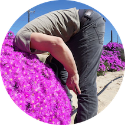

```{r setup, include=FALSE}
knitr::opts_chunk$set(echo = FALSE)
```

<style>
.aligncenter {
    text-align: center;
}
</style>
<p class="aligncenter">

</p>

My name is Glenn Moncrieff, I live in beautiful Cape Town, South Africa. I pass my time trying to think of smart ways of using data to solve problems. My favourite problems to solve are those that involve environmental protection or social justice. My most favourite problems to solve are those that involve remote sensing of vegetation. I divide my energy among a few challenges:

## Data Science in R and Python
I have 8+ years post PhD experience working as a data scientist in academia and industry. I have worked with a range of tools for big data analytics, machine learning, probabilistic programming and geospatial analytics. I try to stay on top of the software stack in these domains

## Remote Sensing
I have 10+ years analysing environmental challenges with remote sensing and geospatial data using scalable tools like Google Earth Engine and xarray

## Ecological Research
I have published over 17 papers in leading global journals and co-authored recent IPCC reports. My research is focused on using machine learning and remote sensing to improve vegetation monitoring

## Mountains/Oceans  
  
When all the sciencing gets too much I escape to the mountains and oceans to surf, hike and rock climb. I try to share this passion with at-risk youth in Cape Town through a non-profit climbing club. We take youth climbing at the local gym, on trips to outdoor climbing spots and connect them with the local climbing community. Find out more at [DreamHigher](http://www.dreamhigher.co.za)  
   
 
### Contact
If you would like to get hold of me, don't hesitate to send me an email at:  
  
<glennmoncrieff@gmail.com>


<div class="appendix-bottom">
<h3 id="reuse">Reuse</h3>
<p>Text and figures are licensed under Creative Commons Attribution <a rel="license" href="https://creativecommons.org/licenses/by/4.0/">CC BY 4.0</a>
</p>
</div>
