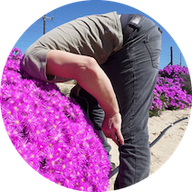

```{=html}
<!-- ===================== HERO ===================== -->
<header class="hero wrap">
  <svg class="hero__mark" viewBox="0 0 100 100" fill="none" aria-hidden="true">
    <polygon points="90,50 70,84.64 30,84.64 10,50 30,15.36 70,15.36" stroke="#3a3f46" stroke-width="2" stroke-linejoin="round"/>
    <polygon points="78,50 64,74.25 36,74.25 22,50 36,25.75 64,25.75" stroke="rgba(20,24,28,0.18)" stroke-width="1.4" stroke-linejoin="round"/>
    <line x1="50" y1="33" x2="37" y2="61" stroke="#6b7079" stroke-width="1.6"/>
    <line x1="50" y1="33" x2="63" y2="61" stroke="#6b7079" stroke-width="1.6"/>
    <line x1="37" y1="61" x2="63" y2="61" stroke="#6b7079" stroke-width="1.6"/>
    <circle cx="50" cy="33" r="5.4" fill="var(--accent)"/>
    <circle cx="37" cy="61" r="5.4" fill="#3a3f46"/>
    <circle cx="63" cy="61" r="5.4" fill="#3a3f46"/>
  </svg>
  <h1>Glenn Moncrieff</h1>
  <p class="hero__tag">Conservation Data Scientist</p>
  <div class="socials">
    <a class="soc" href="https://github.com/GMoncrieff" target="_blank" rel="noopener">GitHub <svg viewBox="0 0 12 12" fill="none"><path d="M3 9L9 3M9 3H4M9 3V8" stroke="currentColor" stroke-width="1.4" stroke-linecap="round" stroke-linejoin="round"/></svg></a>
    <a class="soc" href="https://scholar.google.co.za/citations?user=_FFdaCUAAAAJ" target="_blank" rel="noopener">Google Scholar <svg viewBox="0 0 12 12" fill="none"><path d="M3 9L9 3M9 3H4M9 3V8" stroke="currentColor" stroke-width="1.4" stroke-linecap="round" stroke-linejoin="round"/></svg></a>
    <a class="soc" href="https://www.linkedin.com/in/glenn-moncrieff-a50879227" target="_blank" rel="noopener">LinkedIn <svg viewBox="0 0 12 12" fill="none"><path d="M3 9L9 3M9 3H4M9 3V8" stroke="currentColor" stroke-width="1.4" stroke-linecap="round" stroke-linejoin="round"/></svg></a>
  </div>
</header>

<!-- ===================== ABOUT / LEAD ===================== -->
<section class="section--tight wrap">
  <div class="two-col">
    
    <div>
      <p class="mono" style="margin-bottom:18px;">// About</p>
      <p class="lead">
        I combine algorithms with biodiversity data to solve conservation problems. Most of my
        work uses <strong>AI/machine learning</strong> and <strong>satellite imagery</strong> to
        measure and monitor the natural world, from invasive plants in the fynbos to land cover
        change across whole regions.
      </p>
      <p style="color:var(--text-3); margin-top:22px; max-width:54ch;">
        I am a biodiversity data scientist in the Global Science team at The Nature Conservancy. I have spent more than fifteen years building data and machine learning systems across research, industry,
        and government. When the screen time gets too much I head for the mountains or the sea.
      </p>
      <a class="text-link" href="contact.html" style="margin-top:24px;">Get in touch &rarr;</a>
    </div>
  </div>
</section>

<!-- ===================== WHAT I DO ===================== -->
<section class="section wrap">
  <div class="sec-head">
    <h2>What I Work On</h2>
    <span class="mono">03 areas</span>
  </div>
  <div class="card-grid">
    <div class="card">
      <span class="card__num">01</span>
      <p class="card__body">Monitor <b>biodiversity and ecosystems</b> from satellite and hyperspectral imagery, at the scale of a whole region.</p>
    </div>
    <div class="card">
      <span class="card__num">02</span>
      <p class="card__body">Forecast <b>ecosystem change and human pressure</b> on land, with models that report their own uncertainty.</p>
    </div>
    <div class="card">
      <span class="card__num">03</span>
      <p class="card__body">Build <b>AI/ML tools and pipelines</b> that let conservation teams run the analysis themselves.</p>
    </div>
  </div>
</section>

<!-- ===================== LATEST WRITING ===================== -->
<section class="section--tight wrap">
  <div class="sec-head">
    <h2>Latest Writing</h2>
    <a class="mono" href="blog.html" style="color:var(--text-3);">All posts &rarr;</a>
  </div>
```

::: {#latest}
:::

```{=html}
</section>

<!-- ===================== SELECTED PAPERS ===================== -->
<section class="section wrap">
  <div class="sec-head">
    <h2>Selected Papers</h2>
    <a class="mono" href="papers.html" style="color:var(--text-3);">All publications &rarr;</a>
  </div>
  <div class="rows">
    <a class="row" href="https://doi.org/10.1038/s41597-025-04892-2" target="_blank" rel="noopener">
      <span class="row__date">2025</span>
      <div class="row__main">
        <h3>Global extent and change in human modification of terrestrial ecosystems from 1990 to 2022</h3>
        <p class="paper__venue">Scientific Data</p>
        <p class="paper__authors">D. Theobald, J. Oakleaf, <em>G. Moncrieff</em>, M. Voigt, J. Kiesecker, C. Kennedy</p>
      </div>
      <span class="row__arrow">&rarr;</span>
    </a>
    <a class="row" href="https://doi.org/10.1038/s44185-024-00071-5" target="_blank" rel="noopener">
      <span class="row__date">2025</span>
      <div class="row__main">
        <h3>The Biodiversity Survey of the Cape (BioSCape), integrating remote sensing with biodiversity science</h3>
        <p class="paper__venue">npj Biodiversity</p>
        <p class="paper__authors">A. Cardoso, E. Hestir, J. Slingsby, <em>G. Moncrieff</em>, W. Turner, A. Wilson, et al.</p>
      </div>
      <span class="row__arrow">&rarr;</span>
    </a>
    <a class="row" href="https://doi.org/10.3390/rs14122766" target="_blank" rel="noopener">
      <span class="row__date">2022</span>
      <div class="row__main">
        <h3>Continuous land cover change detection in a critically endangered shrubland ecosystem using neural networks</h3>
        <p class="paper__venue">Remote Sensing</p>
        <p class="paper__authors"><em>G. R. Moncrieff</em></p>
      </div>
      <span class="row__arrow">&rarr;</span>
    </a>
  </div>
</section>
```
