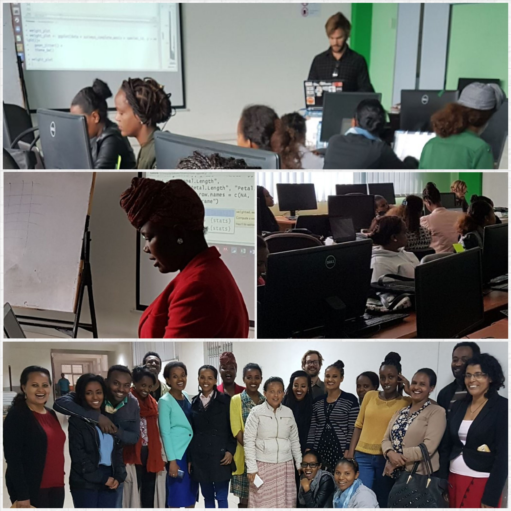

::: {.article}

[← Back to blog](../../blog.qmd){.text-link}

::: {.article__head}

2017 · 10 · 02·3 min read·Teaching

# Data Carpentry in Ethiopia

Teaching R and data literacy in Addis Ababa.

:::

::: {.prose}

The [Ethiopian Education and Research Network (EthERNet)](https://www.ethernet.edu.et/) from the Ministry of Education in collaboration with the [German International Cooperation (GIZ) Sustainable Training and Education Programme (STEP)](https://www.giz.de/en/worldwide/336.html), the [Education Strategy Center (ESC)](http://www.esc.gov.et/) and [Talarify](http://talarify.co.za/) organised its first ever Data Carpentry workshop for young academics and researchers in Ethiopia. The workshop was conducted over two and a half days from 14-16 August 2017 at Addis Ababa Institute of Technology (AAiT).

The main aim was to increase data literacy for researchers and establish a community of good research data practice in Ethiopia in order to increase the presence of Ethiopian researchers in the global research community. Note: UNESCO Statistics Institute reveals that in 2016 1.1% of the global research community are researchers coming from Sub-Saharan Africa. On average 30.4% from all Sub-Saharan researchers are females, whereas Ethiopia counts 13.3 % female researchers out of all Ethiopian researchers.

Over 25 participants from all over Ethiopia joined the workshop. 98% of participants were women representing different research disciplines including animal nutrition, soil sciences, economics, sport sciences and information technology to name a few. The event was lead by Data Carpentry instructors from South Africa with helpers from Ethiopia and mainly covered lessons included in the Data Carpentry Ecology workshop - better use of Spreadsheets, data cleaning in OpenRefine, and data analysis and visualisation in R.

Along with my co-instructor Lactatia Motsuku from the South African National Cancer Registry and lead instructor Anelda van der Walt from [Talarify](http://talarify.co.za/) we delivered a great workshop that was warmly received from participants. Some of our Ethiopian workshop helpers have gone on to qualify as Software Carpentry instructors subsequent to the workshop, further growing the community in Africa.

This was my first experience instructing a data carpentry workshop and I have been inspired to become more involved in the movement after seeing how empowering researchers with the tools to do data driven research can democratise science.

:::

:::
