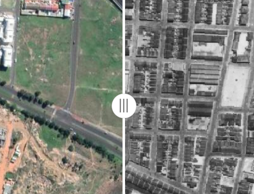

::: {.article}

[← Back to blog](../../blog.qmd){.text-link}

::: {.article__head}

2019 · 09 · 24·5 min read·Remote Sensing

# Wiped off the map

Historical aerial photographs document the communities that apartheid tried to erase.

:::

::: {.prose}

Since the 1930s [aerial photographs](http://www.ngi.gov.za/) covering all of South Africa have been collected, documenting radical changes in our country's landscape. Incredible stories are documented in this archive. They show how human activities have encroached on natural ecosystems, how cities have grown and reshaped themselves over time and in some cases, how apartheid left scars that remain unhealed to this day. Below are three locations showing the brutal reality of how three communities were erased by the apartheid government. In each case one image shows a thriving community taken in 1945, and another shows the area as it appears today. These images give an indication of the scale of the destruction, but they do not tell the human side of this story. I am not qualified to even attempt telling these stories, and therefore leave this unmentioned. Rather, I will add links to where more can be found out.

  This post originally had three interactive before-and-after sliders built with map tiles that are not hosted on this site. They are described in text below. You can explore the original interactive version <a href="https://gmoncrieff.github.io/posts/wiped-off-the-map/" target="_blank" rel="noopener" style="color:var(--accent); border-bottom:1px solid var(--accent-line);">on my old site</a>.

## District Six

> "District Six is a blot which the government has cleaned up and will continue to clear up." - P.W Botha

District Six is the best known example of forced removal in Cape Town. It was a thriving inner city community of around 60 000 people. On 11 February 1966 the apartheid government declared District Six a whites-only area under the Group Areas Act. In the following years the entire community was relocated to the Cape Flats. Home and businesses were demolished, with only a few structures - such as places of worship - escaping the devastation. Attempts to redevelop the land stalled due to condemnation from the international community and uncertainty over potential land restitution. Aside from the construction of the Cape Peninsula University of Technology, much of the land remains undeveloped today. The land restitution process is ongoing, with many claimants upset at the long wait to return home.

`// interactive 1945-vs-today slider — see the original post`

[The District Six museum](https://www.districtsix.co.za/) tells the story of this community in it's own words.

District six may be the best known example, but all over Cape Town non-white residents in areas declared white-only under the group-areas act were being evicted from homes where they had lived for generations. Many of these evictions are not visible in the historical aerial photos, but in the case where entire communities where removed and their homes demolished, the evidence is clear and striking.

## Protea village, Bishopscourt

Neighboring Kirstenbosch National Botanical gardens, what is today known as Boschendal Arboretum in the wealthy suburb of Bishopscourt was previously known as Protea village. When it was demolished at the end of the 1960s, the village had around 600 inhabitants. Many residents were employed at Kirstenbosch or as domestic workers in wealthy households. Almost all the homes and the school in Protea village were destroyed, but the Church of the Good Shepherd and three stone cottages remain today.

`// interactive 1945-vs-today slider — see the original post`

In 2006, under the government's land restitution program, former residents were given back 12.5 hectares of land to which 86 families were planning to return. Anna Bohlin has written about the [history of this community](https://www.tandfonline.com/doi/abs/10.1080/00020184.2011.594638) and the [reaction to their return home](https://link.springer.com/chapter/10.1057/9781137003638_6).

## Constantia

The suburb of Constantia is one of the most upmarket areas of Cape Town, with large houses bordering wine farms and lush green rivers. Before apartheid forced removals, the majority of residents were non-white, with many families farming their own land. During apartheid, non-white land-owners were forced to sell their land, severing the connection that mutligenerational families had with the land and hastening the demise of Constantia's agrarian landscape. The Solomon family, who farmed the land between Ladies Mile and Spaanschemat river road from 1902, occupied their farm for 65 years before they were removed under the Group Areas Act. The Solomon family initiated the restitution process in 1996 and, 10 years later, the Land Claims Court concluded a deed of settlement with the Solomon Family.

`// interactive 1945-vs-today slider — see the original post`

:::

:::
